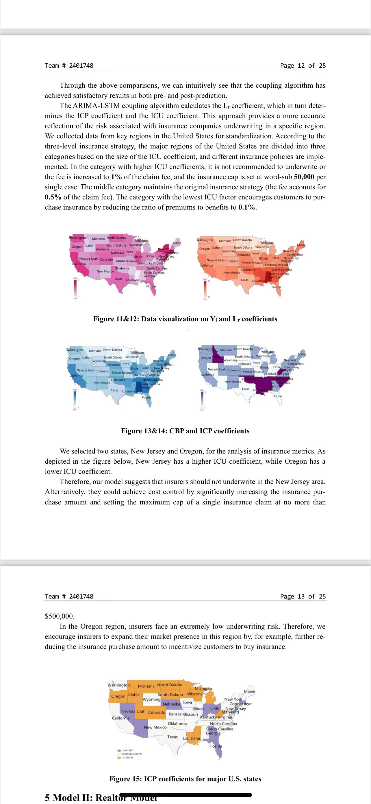

# 数学建模比赛地图绘制代码

> 注：此地图绘制代码并非本人创作，而是数学建模清风老师所创作的，版权应该也归他所有。本人的数学建模比赛成绩取得了M奖，感谢这份地图数据绘制代码的帮助，希望能为大家提供一些帮助。

## 代码说明

在2023年数学建模比赛中，我使用了清风老师提供的地图绘制代码，并成功凭借此数据绘制拿到了M奖。通过此代码可以实现…

## 2401748.pdf
这是我自己的数学建模参赛论文，美工、编程、建模几乎我一个人完成，需要借鉴的可以借鉴，另外可以引用链接https://www.ewadirect.com/proceedings/tns/article/view/12866查看我的论文

